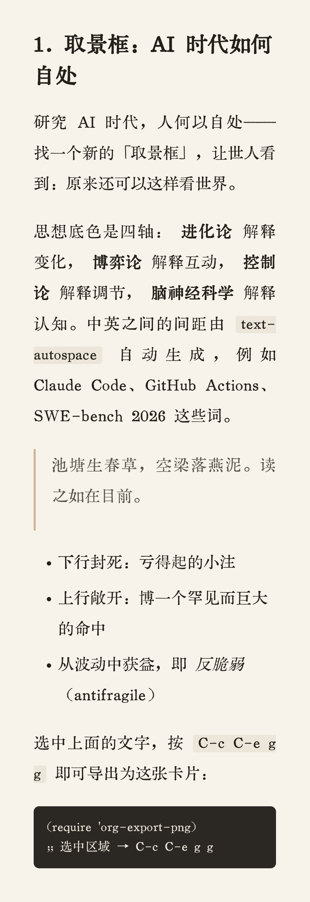

#+title: org-export-png
#+options: toc:2 num:nil

把 Org 选区一键导出为 *排版精良的 PNG 卡片* —— 适合把一段笔记、一个观点、一段代码分享到微信 / 小红书 / 聊天窗口。

中英文之间自动留白（遵循 [[https://github.com/sparanoid/chinese-copywriting-guidelines][中文文案排版指北]]），默认用 *京華老宋体（KingHwa_OldSong）*，默认竖长版式、手机阅读舒适字号。

* 特性

- *选区即卡片*：选中任意文字（或整个 subtree / buffer），一键导出 PNG。
- *优良排版*：版心、行高、两端对齐、引用块、列表、表格、代码块、链接都有讲究的样式。
- *中文排版规范*：中英 / 中数之间的间距由 CSS =text-autospace= 自动生成，*不改动你的原文*。
- *指定字体*：通过 =@font-face= 直接嵌入字体文件，渲染结果与系统是否注册无关，稳定可控。
- *手机友好*：默认窄版心（约 15 字 / 行）、24px 字号、竖长版式，正好在手机上满屏阅读。
- *融入 Org 工作流*：在 =org-export-dispatch=（=C-c C-e=）菜单里多出一项 “Export to PNG image”。
- *纯 Org / 纯 Emacs Lisp*：无需第三方 Emacs 包，渲染交给本机的浏览器。

* 依赖

| 依赖 | 是否必需 | 说明 |
|------+----------+------|
| Emacs 27.1+ | 必需 | |
| Chromium 内核浏览器 | 必需 | Chrome / Brave / Chromium / Edge，用于渲染截图 |
| ImageMagick | 推荐 | =magick= / =convert=，用于裁掉多余留白（缺失则图片会带较多空白） |
| 一款中文字体 | 推荐 | 默认 *京華老宋体（KingHwa_OldSong）*，一款免费老宋体（网络搜索即可下载）；没有也能跑，会回退到系统衬线 |

提示：中英自动间距需要较新的浏览器（Chrome 131+）。旧版本仍可导出，只是少了 =text-autospace= 的自动留白。

* 安装

** 手动

#+begin_src sh
git clone https://github.com/lijigang/org-export-png ~/.emacs.d/site-lisp/org-export-png
#+end_src

#+begin_src emacs-lisp
(add-to-list 'load-path "~/.emacs.d/site-lisp/org-export-png")
(require 'org-export-png)
#+end_src

** use-package + straight.el

#+begin_src emacs-lisp
(use-package org-export-png
  :straight (:host github :repo "lijigang/org-export-png")
  :after org)
#+end_src

** Doom Emacs

=packages.el=：

#+begin_src emacs-lisp
(package! org-export-png
  :recipe (:host github :repo "lijigang/org-export-png"))
#+end_src

=config.el=：

#+begin_src emacs-lisp
(after! org
  (require 'org-export-png))
#+end_src

然后 =doom sync= 并重启（或 =SPC h r r=）。

* 使用

选中一段文字，然后任选其一：

- =C-c C-e g g= —— 通过 =org-export-dispatch= 菜单（看到 “[g] Export to PNG image”）；
- =M-x org-export-png-region= —— 直接命令。

没有选区时，导出当前 subtree 或整个 buffer。PNG 默认写到 =~/Downloads/= 并自动打开。

* 自定义

=M-x customize-group RET org-export-png=，或直接 =setq=。常用项：

| 变量 | 默认值 | 说明 |
|------+--------+------|
| =org-export-png-font= | ="KingHwa_OldSong"= | 正文字体（CSS font-family） |
| =org-export-png-font-file= | 自动探测 | 用 =@font-face= 嵌入的字体文件，可指向任意 .ttf/.ttc/.otf |
| =org-export-png-mono-font= | ="KingHwa_OldSong"= | 代码字体；想要真正等宽设成 ="Menlo"= / ="SF Mono"= |
| =org-export-png-width= | =460= | 版心宽（px）。越窄越竖长，越适合手机 |
| =org-export-png-font-size= | =24= | 字号（px） |
| =org-export-png-line-height= | =1.9= | 行高 |
| =org-export-png-padding= | =50= | 卡片内边距（px） |
| =org-export-png-bg= / =-fg= | 纸色 / 墨色 | 背景色 / 文字色 |
| =org-export-png-scale= | =2= | 设备像素比，2 = 高清 |
| =org-export-png-output-dir= | ="~/Downloads"= | 输出目录 |
| =org-export-png-open-after= | =t= | 导出后是否自动打开 |
| =org-export-png-pangu= | =t= | 给紧贴中文的 =code= / =/斜体/= 标记补空格，使其正确解析 |
| =org-export-png-max-height= | =6000= | 渲染视口高度；超长区域被截断时调大 |
| =org-export-png-trim= | =t= | 是否用 ImageMagick 裁掉多余留白 |
| =org-export-png-browser= | 自动 | 浏览器可执行文件路径 |
| =org-export-png-magick= | 自动 | ImageMagick 路径 |

横版示例（宽一点、字小一点）：

#+begin_src emacs-lisp
(setq org-export-png-width 720
      org-export-png-font-size 20)
#+end_src

* 工作原理

#+begin_example
Org 选区
   │  ox-html（继承 Org 的 HTML 翻译）
   ▼
HTML 片段  ──套上版心 + 排版 CSS──▶  完整 HTML
   │  headless Chrome --screenshot
   ▼
整页 PNG  ──ImageMagick -trim──▶  裁紧的卡片
#+end_example

几个排版细节：

- *中英留白* 用 CSS =text-autospace=（不往原文里塞空格）；
- =org-export-png-pangu= 会在导出前给紧贴全角标点的 =code= / =/斜体/= 等标记补一个空格，否则 Org 不会把它们解析成行内样式（只影响渲染副本，*不动你的 buffer*）；
- 字体经 =@font-face= 以 =url(file://…)= 嵌入，并以 =--allow-file-access-from-files= 让 headless Chrome 读到本地字体文件，做到字体确定可控。

* 字体

默认 *京華老宋体（KingHwa_OldSong）*，一款气质很好的免费老宋体（网络搜索 “京華老宋体” 即可下载）。装好后会被自动探测到。

想换字体：把字体装好，然后

#+begin_src emacs-lisp
(setq org-export-png-font "Your Font Family"
      org-export-png-font-file "/path/to/your-font.otf")  ; 可选，但更稳
#+end_src

* 许可

GPL-3.0-or-later。详见 [[file:LICENSE][LICENSE]]。
